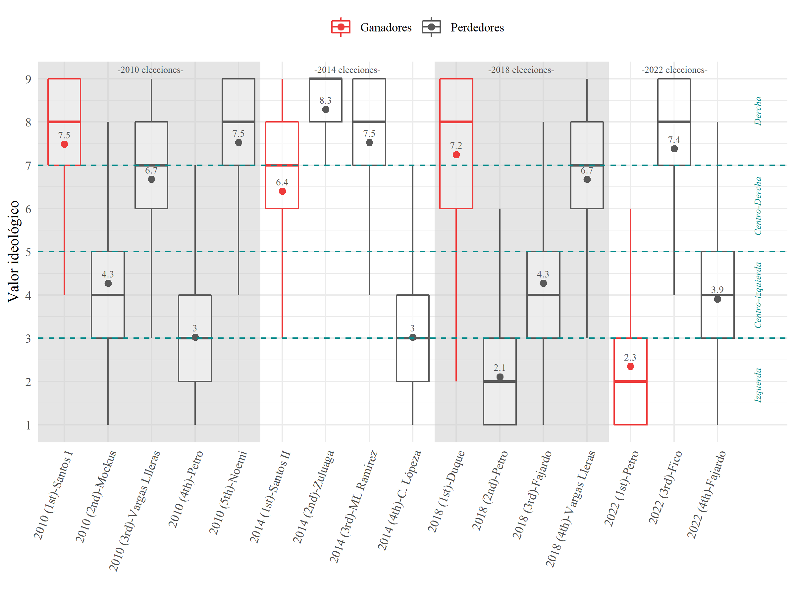

# Populism and susceptibility towards it - prueba sebas

Andres Miguel Samapayo, Guibor Camargo, Sebastian Londoño

This repo contains the scripts and par of the data of the "Populism and susceptibility towards it" and book chapter " ['Populismo' y susceptibilidad territorial](https://docs.google.com/document/d/1Fd9lXbB6gmsjJPTG6Mob7QjGW8AnfITLiFd95_yRNf0/edit?usp=sharing "Vea el capitulo del linbro aca")".

Data sources:

-   Escalas ideológicas: Encuestas de percepcion ideológica, 2020. Universidad del Rosario.

-   

## Capítulo VS artículo

| Tema                                                            |      Capítulo (2022)      |                 Artículo (2023)                 |
|-----------------------------------------------------------------|:-------------------------:|:-----------------------------------------------:|
| Autorias                                                        | Sampayo, Camargo, Londoño |            Londoño, Camargo, Sampayo            |
| Numero de elecciones presidenciales a evaluar                   |             2             |                        4                        |
| Incluye elecciones legislativas                                 |            No             |                       Sí                        |
| Incluye elecciones locales (alcaldes)                           |            No             |                       Sí                        |
| Incluye plebicito por la paz                                    |            No             |                       Sí                        |
| Imputaciones ideológicas por Partido-Candidato                  |            Si             |                       Sí                        |
| Imputaciones ideológicas por Colaición-Apoyos-Partido-Candidato |            No             |                       Si                        |
| Cambios idelógicos                                              |     Inter-ideológicos     |      Inter-ideológicos e intra-ideológicos      |
| Cambios territoriales                                           |   Inversión, Seguridad    | Inversión, Seguridad, Pobreza y Mercado Laboral |
| Variables geográficas                                           |            No             |                       Sí                        |
| Modelos espaciales                                              |            No             |                       Sí                        |
| Controles sintéticos                                            |            No             |                       Sí                        |
