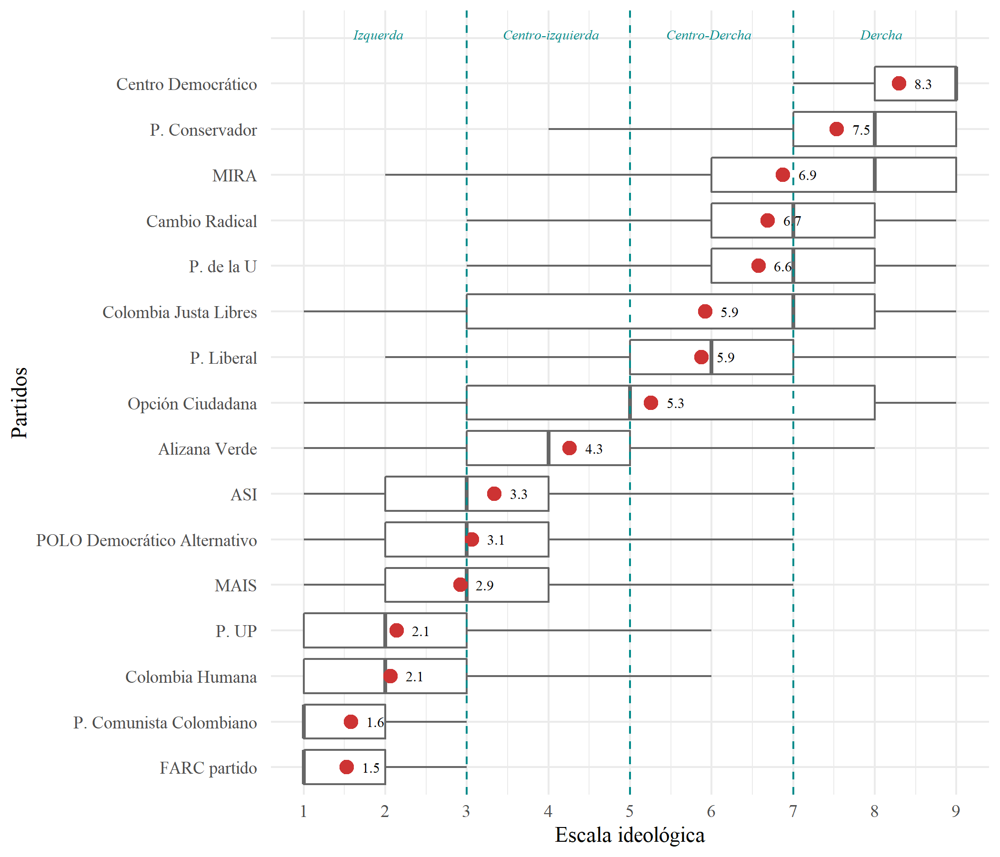

# Populism and susceptibility towards it

Andres Miguel Samapayo, Guibor Camargo, Sebastian Londoño

This repo contains the scripts and par of the data of the "Populism and susceptibility towards it" and book chapter " ['Populismo' y susceptibilidad territorial](https://docs.google.com/document/d/1Fd9lXbB6gmsjJPTG6Mob7QjGW8AnfITLiFd95_yRNf0/edit?usp=sharing "Vea el capitulo del linbro aca")".

Data sources:

-   Escalas ideológicas: Encuestas de percepcion ideológica, 2020. Universidad del Rosario.

-   

